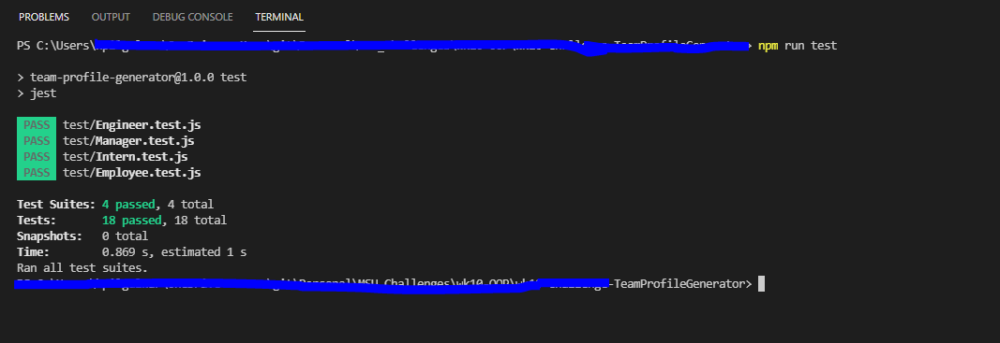
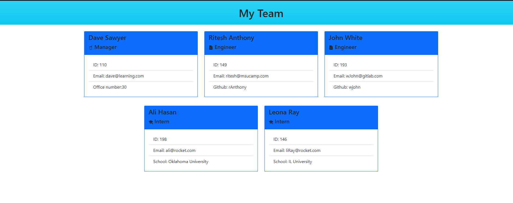

# Team Profile Generator
  Generates team profile data based on user input

      

  # Table of contents
  * [Purpose](#purpose)
  * [Installation Guidelines](#installation-guidelines)
  * [Usage](#usage)
  * [Contributors](#contributors)
  * [Test Instructions](#test-instructions)
  * [More Information](#more-information)
  * [License](#license)

  ## Purpose
  Build a Node.js command-line application that takes in information about employees on a software engineering team and generates an HTML webpage that displays summaries for each person.

  ## Istallation Guidelines
   After cloning this project please follow below steps for installation from root of this directory
                    
  - $ npm install
  - $ node index
  - Then answer questions based on your need

  ## Usage
  For generating team profile data

  ## Contributors
  Krupali

  ## Test Instructions
 npm run test
 

  ## More Information
  Please find below acceptance criteria of project:

    GIVEN a command-line application that accepts user input
    WHEN I am prompted for my team members and their information
    THEN an HTML file is generated that displays a nicely formatted team roster based on user input
    WHEN I click on an email address in the HTML
    THEN my default email program opens and populates the TO field of the email with the address
    WHEN I click on the GitHub username
    THEN that GitHub profile opens in a new tab
    WHEN I start the application
    THEN I am prompted to enter the team manager’s name, employee ID, email address, and office number
    WHEN I enter the team manager’s name, employee ID, email address, and office number
    THEN I am presented with a menu with the option to add an engineer or an intern or to finish building my team
    WHEN I select the engineer option
    THEN I am prompted to enter the engineer’s name, ID, email, and GitHub username, and I am taken back to the menu
    WHEN I select the intern option
    THEN I am prompted to enter the intern’s name, ID, email, and school, and I am taken back to the menu
    WHEN I decide to finish building my team
    THEN I exit the application, and the HTML is generated

Deployed application:

  Please watch below video on team profile is generated on executing this application: 

  https://drive.google.com/file/d/1B3EX_GkO13Sa_KfLmYxWQocS_YmUl7T-/view

  
  ## License
  Please consult the attached LICENSE file for details. All rights not explicitly granted by the MIT,Apache License are reserved by Original Author.
    

  Copyright (c) 2021
